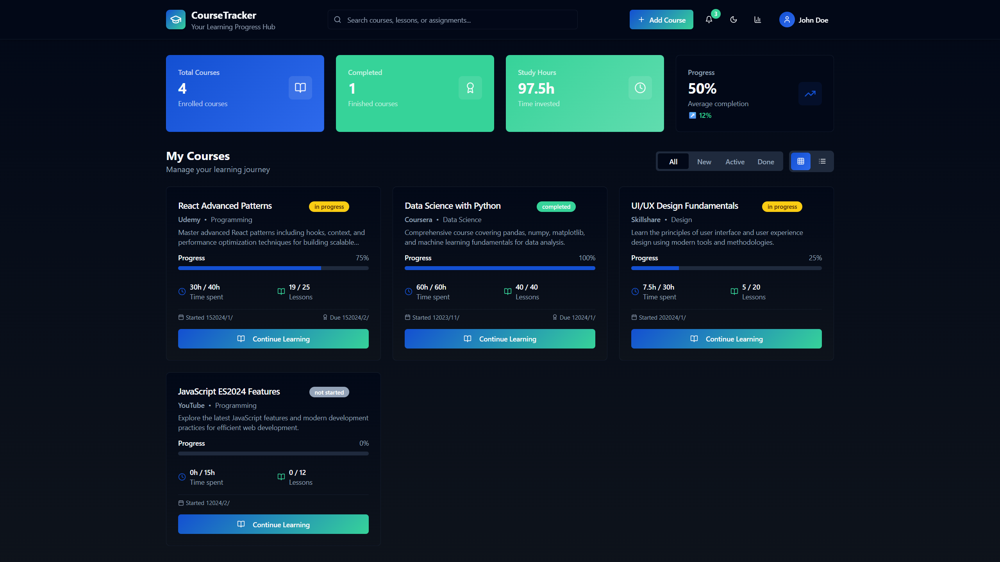

# 🎓 Academic Pathfinder

## 📸 Dashboard Screenshots

### Dashboard



---

## 📖 Overview

**Academic Pathfinder** is an advanced web application designed to manage educational pathways and course materials in an intelligent and organized manner. The system provides a comprehensive platform for students and teachers to manage educational courses, lessons, and assignments while tracking progress and achievements.

## 🚀 Key Features

- **Course Management**: Create and organize educational courses
- **Lesson Management**: Organize educational content into separate lessons
- **Assignment System**: Create and track assignments and tasks
- **Learning Proof**: Track progress and achievements
- **Comprehensive Statistics**: Display data and analytics
- **Modern User Interface**: Responsive and advanced design

## 🏗️ Technical Architecture

### Frontend (User Interface)

#### Technologies Used
- **React 18** - User interface library
- **TypeScript** - For writing safe and organized code
- **Vite** - Fast build tool
- **Tailwind CSS** - CSS framework for design
- **Shadcn/ui** - Advanced UI component library

#### Main Pages
- **Home Page** (`Index.tsx`) - Display courses and statistics
- **Course Details** (`CourseDetail.tsx`) - Show course content and lessons
- **404 Page** (`NotFound.tsx`) - Error page

#### Core Components
- **Header** - Main navigation bar
- **CourseCard** - Course display card
- **LessonCard** - Lesson display card
- **AssignmentCard** - Assignment display card
- **StatsCard** - Statistics display
- **ProofOfLearning** - Learning proof and progress

#### Dialog Windows
- **AddCourseDialog** - Add new course
- **AddLessonDialog** - Add new lesson
- **AddAssignmentDialog** - Add new assignment

#### UI Components
- **Button** - Multiple style buttons
- **Card** - Content display cards
- **Dialog** - Dialog windows
- **Form** - Input forms
- **Input** - Input fields
- **Select** - Selection lists
- **Toast** - System notifications
- **ThemeToggle** - Theme switching

### Backend (Server Side)

#### Technologies Used
- **Node.js** - JavaScript runtime environment
- **Express.js** - Web framework
- **MongoDB** - Database
- **Mongoose** - Database ODM
- **JWT** - User authentication

#### Models
- **Course** - Educational course model
- **Lesson** - Lesson model
- **Assignment** - Assignment model
- **User** - User model
- **Progress** - Progress model

#### API Endpoints
- **Authentication**: Login and registration
- **Courses**: CRUD for educational courses
- **Lessons**: Manage lessons within courses
- **Assignments**: Manage assignments and tasks
- **Progress**: Track user progress

## 📱 Advanced Features

- **Responsive Design**: Works on all devices
- **Dark Mode**: Support for dark and light themes
- **Instant Notifications**: System alerts
- **Advanced Search**: Content search functionality
- **Filtering and Sorting**: Data organization
- **Data Export**: Save reports

## 🚧 Development Status

**⚠️ This project is under active development**

We are continuously working on improving and developing new features. Some functions may be incomplete or under testing.

## 🛠️ Installation and Setup

### Prerequisites
- Node.js (Version 18 or later)
- npm or yarn or bun
- Modern web browser

### Installation Steps

1. **Clone the project**
```bash
git clone [project-url]
cd academi-pathfinder
```

2. **Install dependencies**
```bash
npm install
# or
yarn install
# or
bun install
```

3. **Run the project**
```bash
npm run dev
# or
yarn dev
# or
bun dev
```

4. **Open browser**
```
http://localhost:5173
```

## 📁 Project Structure

```
academi-pathfinder/
├── src/
│   ├── components/          # Main components
│   │   ├── ui/             # Basic UI components
│   │   └── *.tsx           # Application-specific components
│   ├── pages/              # Application pages
│   ├── hooks/              # React Hooks
│   ├── lib/                # Helper libraries
│   └── main.tsx            # Entry point
├── public/                 # Public files
├── package.json            # Project dependencies
└── README.md               # This file
```

## 🤝 Contributing

We welcome your contributions! Please follow these steps:

1. Fork the project
2. Create a feature branch
3. Make changes
4. Submit a Pull Request

## 📄 License

This project is licensed under the MIT License.

## 📞 Support

For any questions or issues, please contact us via:
- Create an Issue on GitHub
- Send an email

---

**Developed by the Academic Pathfinder Team** 🚀
